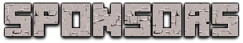

# Docker Minecraft Server for Pterodactyl Panel

This is a fork of [itzg/docker-minecraft-server](https://github.com/itzg/docker-minecraft-server) customized for use with Pterodactyl Panel.

## Pterodactyl Eggs

Pterodactyl Panel eggs for this image can be found in [the eggs directory](eggs) of this repo:

- [Vanilla](eggs/egg-itzg-vanilla.json)
- [Forge](eggs/egg-itzg-forge.json)
- [Fabric](eggs/egg-itzg-fabric.json)
- [NeoForge](eggs/egg-itzg-neoforge.json)
- [CurseForge](eggs/egg-itzg-curseforge.json)
- [Modrinth](eggs/egg-itzg-modrinth.json)
- [FTB](eggs/egg-itzg-ftb.json)

> **Note:** The eggs contain the minimal required environment variables. For a complete list of all supported environment variables, please refer to the [documentation](https://docker-minecraft-server.readthedocs.io/).

## Original README

 

There you will find things like
- [Quick start with Docker Compose](https://docker-minecraft-server.readthedocs.io/en/latest/#using-docker-compose)
- Running [different versions of Minecraft](https://docker-minecraft-server.readthedocs.io/en/latest/versions/minecraft/) and using [various server types](https://docker-minecraft-server.readthedocs.io/en/latest/types-and-platforms/) for Java Edition
- [Setting server properties via container environment variables](https://docker-minecraft-server.readthedocs.io/en/latest/configuration/server-properties/)
- [Managing mods and plugins with automated downloads and cleanup](https://docker-minecraft-server.readthedocs.io/en/latest/mods-and-plugins/)
- [Using various modpack providers/platforms](https://docker-minecraft-server.readthedocs.io/en/latest/types-and-platforms/)
- ...and much more

There are also many examples located in [the examples directory](examples) of this repo.

This image only supports Java edition natively; however, if looking for a server that is compatible with Bedrock edition, then use [itzg/minecraft-bedrock-server](https://github.com/itzg/docker-minecraft-bedrock-server) or [refer to this section](https://docker-minecraft-server.readthedocs.io/en/latest/misc/examples/#bedrock-compatible-server) to add Bedrock compatibility to a Java edition server.

<a href="https://spawnbox.app"><b>SpawnBox</b></a> - Powered by <code>itzg/minecraft-server</code>, it's a Windows desktop app for parents, teens, and friend groups who want a Minecraft server on their own PC without learning Docker, WSL2, or networking.

 

<a href="https://server.pro"><b>Server.pro</b></a> - A game server hosting platform offering one-click Minecraft server deployment powered by <code>itzg/minecraft-server</code>, with global locations and an easy-to-use control panel.

 

<!-- additional sponsors repeat the pattern above: floated logo + blurb + clear-left break -->
<!-- logo image preferrably hosted on an external, stable site at a size of 48x48px -->
<!-- link to sponsor site -->
<!-- one or two line summary ideally with a mention of image integration -->

[and more...](https://github.com/sponsors/itzg)
